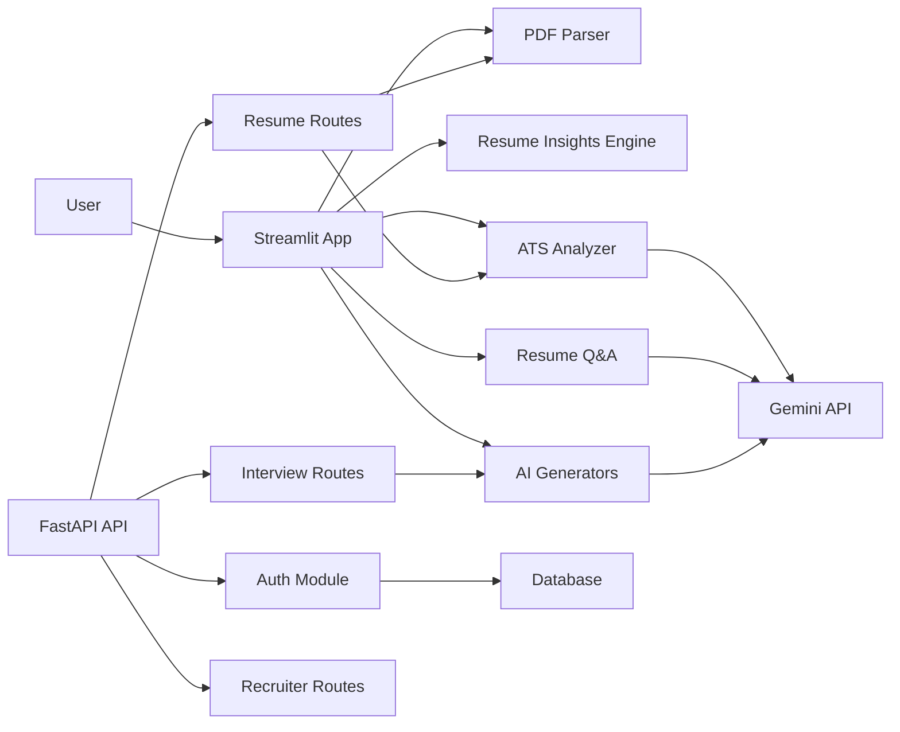
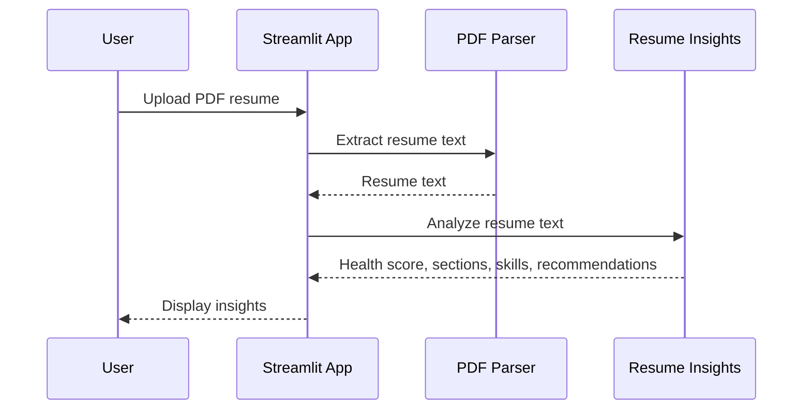
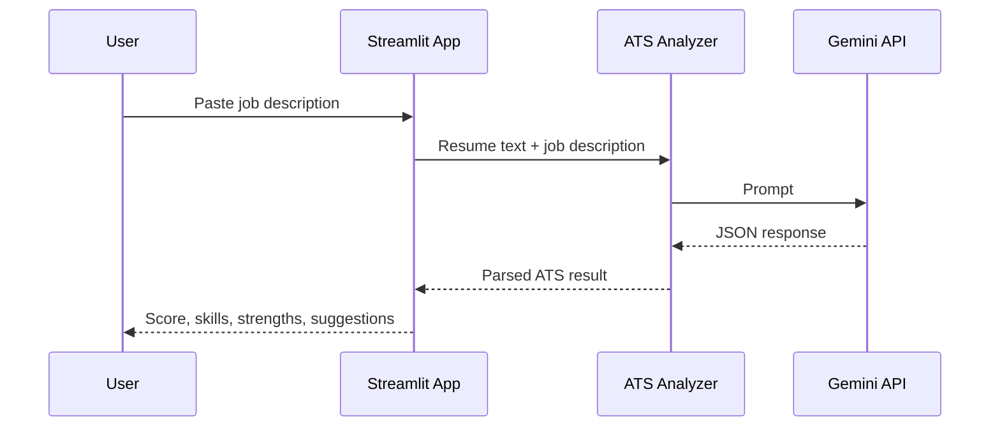

# AI Resume Analyzer Architecture

## Overview

AI Resume Analyzer is a Python-based resume intelligence platform. It includes a Streamlit frontend, FastAPI backend routes, authentication utilities, resume parsing, ATS analysis, resume insights, resume Q&A, and Gemini-powered content generation.

## High-Level Architecture



## Main Components

### Streamlit Frontend

Entry point:

```text
app.py
```

Responsibilities:

- Provides the main user interface.
- Handles resume PDF upload.
- Displays the premium dashboard-style UI.
- Provides workspaces for Resume Insights, ATS Analyzer, Resume Chat, Interview Generator, Cover Letter, Skill Gap, Resume Rewriter, and LinkedIn Optimizer.

Assets:

```text
assets/styles.css
assets/banner.png
assets/logo.png
```

### FastAPI Backend

Entry point:

```text
api/main.py
```

Responsibilities:

- Exposes API endpoints.
- Registers route modules.
- Provides backend access for authentication, resume analysis, interview generation, and recruiter views.

Routes:

```text
api/routes/auth_routes.py
api/routes/resume_routes.py
api/routes/interview_routes.py
api/routes/recruiter_routes.py
```

### Authentication

Files:

```text
auth/register.py
auth/login.py
auth/password_hash.py
auth/jwt_handler.py
api/middleware/auth_middleware.py
```

Responsibilities:

- Register users.
- Login users.
- Hash and verify passwords.
- Generate and verify JWT access tokens.
- Protect authenticated routes when needed.

### Database Layer

Files:

```text
database/postgres.py
database/models.py
database/crud.py
database/init_db.py
database/schemas.py
```

Responsibilities:

- Configure SQLAlchemy database connection.
- Define database models.
- Provide CRUD helpers.
- Initialize database tables.

### Resume Parsing

File:

```text
backend/parser.py
```

Responsibilities:

- Reads uploaded PDF files.
- Extracts resume text using `pypdf`.
- Returns extracted text for analysis and generation.

### Resume Insights Engine

File:

```text
backend/resume_insights.py
```

Responsibilities:

- Provides deterministic, non-AI resume analysis.
- Detects contact signals, sections, missing sections, skills, keywords, bullet counts, and quantified bullet points.
- Produces a resume health score and priority recommendations.

### ATS Analyzer

File:

```text
backend/analyzer.py
```

Responsibilities:

- Builds an ATS prompt.
- Sends resume and job description to Gemini.
- Parses the JSON response.
- Returns ATS score, matching skills, missing skills, strengths, and suggestions.

Fallback behavior:

- If Gemini quota is exhausted or unavailable, returns a safe JSON fallback instead of crashing.

### Resume Chat

File:

```text
backend/rag.py
```

Responsibilities:

- Splits resume text into chunks.
- Builds local context for resume Q&A.
- Supports FAISS vector store functions.
- Answers resume questions using Gemini and relevant resume context.

Current behavior:

- Resume upload does not require embeddings.
- Resume Chat can use uploaded resume text directly.
- This avoids breaking uploads when Gemini embeddings are unavailable.

### AI Content Generators

Files:

```text
backend/interview_generator.py
backend/cover_letter.py
backend/skill_gap.py
backend/resume_rewriter.py
backend/linkedin_optimizer.py
backend/job_recommender.py
```

Responsibilities:

- Generate interview questions.
- Generate cover letters.
- Analyze skill gaps.
- Rewrite resume bullet points.
- Optimize LinkedIn profile content.
- Recommend job roles.

Fallback behavior:

- AI quota and provider errors are handled through `backend/ai_fallbacks.py`.
- If Gemini is unavailable, the app returns helpful local fallback content instead of displaying a traceback.

### Configuration

File:

```text
backend/config.py
```

Environment variables:

```env
GEMINI_API_KEY=your_gemini_key
DATABASE_URL=your_database_url
SECRET_KEY=your_jwt_secret
```

## Data Flow

### Resume Upload Flow



### ATS Analysis Flow



## Error Handling Strategy

The app avoids exposing raw backend errors to users where possible.

Handled scenarios:

- Gemini quota exhaustion
- Gemini API provider errors
- Invalid AI JSON response
- Missing resume upload
- Missing job description or question
- PDF extraction failure

## Testing

Run tests:

```bash
python -m pytest -q
```

Or on Windows with the project virtual environment:

```powershell
.\venv\Scripts\python.exe -m pytest -q
```

## Project Structure

```text
ai-resume-analyzer/
├── api/
├── assets/
├── auth/
├── backend/
├── database/
├── docs/
├── frontend/
├── tests/
├── app.py
├── requirements.txt
└── .gitignore
```
